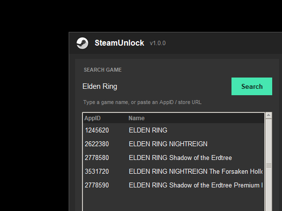
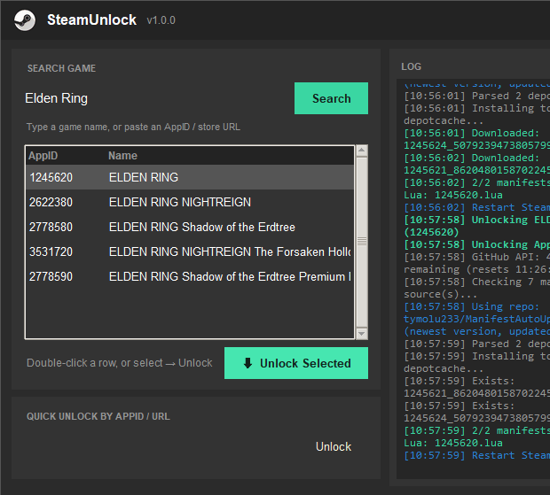

# SteamUnlock

Open-source Steam manifest tool. No drivers, no installer, no spyware.

> **You can do anything with this project except sell it.** CC BY-NC 4.0.

---

## The problem with SteamTools

SteamTools is closed-source, ships a kernel driver that runs 24/7, and constantly triggers antivirus alerts. Nobody can actually read what it does. It felt like a Chinese virus sitting on my PC and there's a real ban risk if Valve ever decides to act on kernel-level hooks.

So I pulled together a few open-source projects that each solved one piece of this (manifest downloaders, depot key dumpers, Lua generators) and merged them into one auditable tool. Every line is in this repo.

---

## Screenshots

> **Add your own screenshots here.** Capture the floating overlay, the main window, and a successful unlock log, then drop them in a `screenshots/` folder and update these paths.

```
screenshots/overlay.png     - the floating icon on your desktop
screenshots/main.png        - the search + unlock window
screenshots/unlock.gif      - a full unlock flow (screen record + convert to gif)
```





---

## How it works

Steam validates game files against depot manifests, small metadata files that map which files belong to a specific build. When someone legally owns a game they can export these manifests. The community uploads them to public GitHub repos. SteamUnlock fetches those and drops them into Steam's own directories alongside a Lua script the SteamTools shim reads on startup.

**The pipeline:**

1. Search the Steam store API by name or AppID
2. Hit 14 known community repos in parallel, plus a live GitHub code search for any repo we don't know about yet
3. Pick the repo with the newest commit for that AppID branch
4. Download `.manifest` files through CDN mirrors with fallback (jsDelivr, jsdmirror, raw.githubusercontent, etc.)
5. Write manifests to `Steam/depotcache/` and drop a `{appid}.lua` into `Steam/config/stplug-in/`
6. Restart Steam, done

---

## vs SteamTools

| | SteamTools | SteamUnlock |
|---|---|---|
| Source code | closed | fully open |
| Kernel driver | yes, always running | none |
| Background service | yes | none, exits when you close it |
| Antivirus | constant flags | clean |
| Ban risk | kernel hooks | plain file writes |
| Manifest repos searched | handful | 14 + live GitHub search |
| GitHub token support | no | yes (.env or in-app) |
| Install required | yes | single exe, double-click |

---

## Does coverage update automatically?

Yes. The community repos (ManifestAutoUpdate, ManifestHub, etc.) get new manifests pushed to them whenever someone uploads a game. SteamUnlock always fetches the current HEAD so you get whatever was uploaded most recently, no app update needed.

For games not in any known repo, SteamUnlock uses the GitHub code search API to scan every public repo for manifest files matching that AppID. This catches repos we've never heard of. A GitHub token is required for this to work reliably since the search API is auth-gated.

---

## Setup

### Standalone (easiest)

Grab `SteamUnlock.exe` from [Releases](../../releases). Double-click. Done.

### From source

```bash
git clone https://github.com/yourname/SteamUnlock
cd SteamUnlock
pip install aiohttp pillow
pythonw SteamUnlock/SteamUnlock_GUI.pyw
```

CLI version if you prefer the terminal:

```bash
python SteamUnlock/steamunlock.py
python SteamUnlock/steamunlock.py unlock 730
python SteamUnlock/steamunlock.py search "elden ring"
```

### GitHub token

Without one you get 60 API requests per hour. Searches start failing mid-way once you hit it. A free token bumps that to 5000/hr and unlocks the live repo discovery search.

To get one: GitHub Settings > Developer settings > Personal access tokens > New classic token. No scopes needed, public repos are readable by default.

Put it in `SteamUnlock/.env`:

```
GITHUB_TOKEN=ghp_yourtoken
```

Or paste it directly in the app: right-click the overlay icon > Settings.

### Building the exe yourself

```bash
pip install pyinstaller
cd SteamUnlock
build_exe.bat
```

Outputs `SteamUnlock/dist/SteamUnlock.exe`, single file, no Python needed on the target machine.

---

## Stack

- **Python 3** with `aiohttp` for async parallel fetching across all repos simultaneously
- **tkinter** for the GUI (no extra install, ships with Python)
- **Pillow** for icon rendering
- **PyInstaller** to bundle it all into the standalone exe

Manifest sources: SteamAutoCracks/ManifestHub, ikun0014/ManifestHub, Masaiki/ManifestAutoUpdate, Auiowu/ManifestAutoUpdate, tymolu233/ManifestAutoUpdate-fix, wxy1343/ManifestAutoUpdate, hansaes/ManifestAutoUpdate, cyao2q/ManifestAutoUpdate, reindex-ot/ManifestAutoUpdate, isKoi/ManifestAutoUpdate, Cyberbolt/ManifestAutoUpdate, Fairyvmos/bruh-hub, ManifestAutoUpdate/ManifestAutoUpdate, Cracko298/ManifestHub

---

## License

CC BY-NC 4.0. Use it, modify it, share it, fork it. Just don't sell it.
